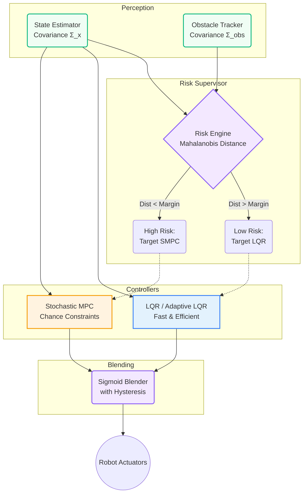

# Risk-Aware Hybrid LQR-MPC Navigation for Autonomous Systems

A ROS2-based implementation of a sophisticated hybrid control system bridging the computational efficiency of a Linear Quadratic Regulator (LQR) with the structurally secure constraints of Stochastic Model Predictive Control (SMPC).


---

## Table of Contents

- [Overview](#overview)
- [Architecture Diagram](#architecture-diagram)
- [Project Structure](#project-structure)
- [Quick Start (Standalone)](#quick-start-standalone)
- [Full Setup Guide](#full-setup-guide)
  - [Windows: WSL2 Installation](#windows-wsl2-installation)
  - [ROS2 Installation](#ros2-installation)
  - [Project Setup](#project-setup)
- [Usage](#usage)
- [Architecture](#architecture)
- [Recent Additions](#recent-additions)

---

## Overview

This project implements a **smooth supervisory hybrid control system** for autonomous differential-drive robots:

| Component | Controller | Purpose |
|-----------|------------|---------|
| **Trajectory Tracking** | LQR | Low-risk, high-speed tracking |
| **Obstacle Avoidance** | SMPC | High-risk, constraint-aware Stochastic MPC |
| **Blending Supervisor** | Sigmoid | Continuous arbitration: `u = w·u_mpc + (1-w)·u_lqr` |
| **Adaptive LQR/MPC** | CasADi/IPOPT | Online parameter estimation + nonlinear MPC |

**Key Features:**
- **Covariance-Driven Mahalanobis Formulation**: Replaces basic Euclidean logic with overlapping Gaussian collision probability constraints, enabling exact control over the margin scalar ($\Sigma_x + \Sigma_{obs}$).
- **Stochastic Model Predictive Control (SMPC)**: Activates exclusively when probabilistic risk thresholds are breached, ensuring collision-free paths via Inverse-CDF margins ($\Pr(\text{collision}) \le \epsilon$).
- **Adaptive LQR Tracking**: Auto-tunes unmodeled dynamics (actuator mismatches, inertia) via active learning to maximize the percentage of time spent in LQR execution without tracking degradation.
- **Checkpoints**: Automatically degrades continuous tracking to intermittent coordinate goals when encountering hyper-dense constraints, mathematically guaranteeing MPC stability.
- **Smooth blending** with anti-chatter guarantees (rate-limited sigmoid + hysteresis).
- Standalone simulation (no ROS2 required) + full ROS2 integration + comprehensive Monte Carlo testing framework.

---

## Architecture Diagram



---

## Project Structure

```
Risk-Aware-Hybrid-LQR-MPC-Navigation-for-Autonomous-Systems/
│
├── run_simulation.py              # ⭐ Standalone test script (start here!)
│
├── src/hybrid_controller/         # ROS2 Package
│   ├── package.xml               # ROS2 manifest
│   ├── setup.py                  # Python package setup
│   ├── config/
│   │   └── params.yaml           # All tunable parameters
│   ├── launch/
│   │   ├── lqr_tracking.launch.py
│   │   ├── mpc_obstacle.launch.py
│   │   └── hybrid_gazebo.launch.py    # ROS2 + Gazebo harness
│   └── hybrid_controller/
│       ├── models/
│       │   ├── differential_drive.py  # Robot kinematics
│       │   ├── linearization.py       # Jacobians, ZOH discretization
│       │   └── actuator_dynamics.py   # Delay, lag, noise modeling
│       ├── controllers/
│       │   ├── lqr_controller.py      # LQR + DARE solver
│       │   ├── mpc_controller.py      # MPC + CVXPY/OSQP
│       │   ├── cvxpygen_solver.py     # Parametrised MPC (38× speedup)
│       │   ├── adaptive_mpc_controller.py  # ⭐ Adaptive MPC (CasADi/IPOPT)
│       │   ├── hybrid_blender.py      # ⭐ Smooth blending supervisor
│       │   ├── risk_metrics.py        # Risk assessment engine
│       │   └── yaw_stabilizer.py      # PID heading stabilizer
│       ├── trajectory/
│       │   └── reference_generator.py # Figure-8, circle, clover, slalom, checkpoints
│       ├── logging/
│       │   └── simulation_logger.py   # Structured logging + jerk metrics
│       ├── utils/
│       │   └── visualization.py       # Plotting
│       └── nodes/
│           ├── trajectory_node.py
│           ├── lqr_node.py
│           ├── mpc_node.py
│           ├── hybrid_node.py         # ROS2 hybrid controller node
│           ├── kinematic_sim_node.py   # Lightweight odom bridge
│           └── state_estimator_node.py
│
├── docker/                            # Container validation scripts
│   ├── entrypoint.sh
│   ├── run_validation_suite.sh
│   ├── run_gazebo_suite.sh
│   └── run_full_pipeline.sh
│
├── evaluation/                        # Monte Carlo benchmarking
│   ├── statistical_runner.py
│   ├── scenarios.py
│   └── results/
│
├── docs/
│   ├── Code_Review.md                 # Full technical documentation
│   ├── Report/report.tex              # LaTeX project report
│   ├── formal_proofs.md               # Stability + no-chattering proofs
│   ├── Project_Proposal.md
│   ├── Work_Progress.md
│   └── technical_report.tex
│
├── tests/                             # Pytest suite
├── worlds/                            # Gazebo SDF worlds
├── outputs/                           # Generated plots (auto-created)
└── logs/                              # Simulation logs (auto-created)
```

---

## Quick Start (Standalone)

**No ROS2 required!** Test the algorithms immediately:

### 1. Install Python Dependencies

```bash
pip install numpy scipy cvxpy matplotlib pyyaml
# Optional: for adaptive MPC
pip install casadi
```

On Windows, Python 3.11 is recommended for adaptive CasADi runs.

### 2. Run Simulations

```bash
cd "d:/Risk-Aware-Hybrid-LQR-MPC-Navigation-for-Autonomous-Systems"

# LQR trajectory tracking
python run_simulation.py --mode lqr

# MPC with obstacle avoidance
python run_simulation.py --mode mpc

# Compare LQR vs MPC
python run_simulation.py --mode compare

# ⭐ Smooth hybrid controller
python run_simulation.py --mode hybrid

# Adaptive nonlinear MPC
python run_simulation.py --mode adaptive

# Hybrid LQR + Adaptive MPC
python run_simulation.py --mode hybrid_adaptive

# Different trajectories
python run_simulation.py --mode lqr --trajectory circle
python run_simulation.py --mode hybrid --trajectory slalom
python run_simulation.py --mode lqr --trajectory checkpoint_path --checkpoint-preset warehouse
python run_simulation.py --mode hybrid --trajectory lissajous
python run_simulation.py --mode mpc --trajectory clothoid

# Checkpoint-based tracking mode
python run_simulation.py --mode hybrid --trajectory urban_path --checkpoint-mode

# Dynamic obstacle scenarios
python run_simulation.py --mode hybrid --scenario moving --duration 10 --no-plot
python run_simulation.py --mode hybrid_adaptive --scenario random_walk --duration 10 --no-plot
```

### 3. View Results

- **Plots:** `outputs/` directory
- **Logs:** `logs/` directory

---

## Full Setup Guide

### Windows: WSL2 Installation

If you're on Windows and want to run the full ROS2 simulation:

#### Step 1: Enable WSL2

Open **PowerShell as Administrator** and run:

```powershell
wsl --install
wsl --set-default-version 2
# Restart your computer
```

#### Step 2: Install Ubuntu 22.04

```powershell
wsl --install -d Ubuntu-22.04
wsl -d Ubuntu-22.04
```

#### Step 3: Update Ubuntu

```bash
sudo apt update && sudo apt upgrade -y
```

---

### ROS2 Installation

Inside WSL Ubuntu (or native Linux):

#### Step 1: Setup Sources

```bash
sudo apt install locales
sudo locale-gen en_US en_US.UTF-8
sudo update-locale LC_ALL=en_US.UTF-8 LANG=en_US.UTF-8
export LANG=en_US.UTF-8

sudo apt install software-properties-common
sudo add-apt-repository universe

sudo apt update && sudo apt install curl -y
sudo curl -sSL https://raw.githubusercontent.com/ros/rosdistro/master/ros.key -o /usr/share/keyrings/ros-archive-keyring.gpg

echo "deb [arch=$(dpkg --print-architecture) signed-by=/usr/share/keyrings/ros-archive-keyring.gpg] http://packages.ros.org/ros2/ubuntu $(. /etc/os-release && echo $UBUNTU_CODENAME) main" | sudo tee /etc/apt/sources.list.d/ros2.list > /dev/null
```

#### Step 2: Install ROS2 Humble

```bash
sudo apt update
sudo apt install ros-humble-desktop -y
sudo apt install ros-dev-tools python3-colcon-common-extensions -y
```

#### Step 3: Setup Environment

```bash
echo "source /opt/ros/humble/setup.bash" >> ~/.bashrc
source ~/.bashrc
```

#### Step 4: Install Gazebo (Optional)

```bash
sudo apt install ros-humble-gazebo-ros-pkgs -y
```

---

### Project Setup

#### Step 1: Clone/Copy Project to WSL

```bash
mkdir -p ~/ros2_ws/src
cd ~/ros2_ws/src
cp -r /mnt/d/Risk-Aware-Hybrid-LQR-MPC-Navigation-for-Autonomous-Systems .
```

#### Step 2: Install Python Dependencies

```bash
pip3 install numpy scipy cvxpy matplotlib pyyaml casadi
```

#### Step 3: Build ROS2 Package

```bash
cd ~/ros2_ws
rosdep install --from-paths src --ignore-src -r -y
colcon build --packages-select hybrid_controller
source install/setup.bash
```

---

## Usage

### Standalone Simulation (Recommended for Testing)

```bash
python run_simulation.py --mode lqr      # LQR only
python run_simulation.py --mode mpc      # MPC with obstacles
python run_simulation.py --mode compare  # Side-by-side comparison
python run_simulation.py --mode hybrid   # ⭐ Smooth blending hybrid
python run_simulation.py --mode adaptive  # Adaptive nonlinear MPC
python run_simulation.py --mode hybrid_adaptive  # Hybrid LQR + Adaptive MPC

# Options
python run_simulation.py --mode hybrid --duration 30 --scenario dense
python run_simulation.py --mode hybrid --scenario corridor --no-plot
python run_simulation.py --mode hybrid --scenario moving --duration 10 --no-plot
python run_simulation.py --mode hybrid --trajectory lissajous --checkpoint-mode --no-plot
```

**Obstacle Scenarios:**
| Scenario | Description |
|----------|-------------|
| `default` | 3 obstacles on Lissajous path |
| `sparse` | Single obstacle |
| `dense` | 5 obstacles, tight clearances |
| `corridor` | Narrow passage configuration |
| `moving` | Bounded linear moving obstacles |
| `random_walk` | Bounded random-walk moving obstacles |

**Trajectory Families:**
| Trajectory | Description |
|------------|-------------|
| `figure8` | Default Lissajous figure-8 |
| `circle` | Simple circular path |
| `clover` | Three-lobed clover pattern |
| `slalom` | S-curve slalom |
| `checkpoint_path` | Waypoint-based path (use `--checkpoint-preset`) |
| `lissajous` | Parametric Lissajous curve with configurable harmonics |
| `spiral` | Outward spiral trajectory with increasing radius |
| `spline_path` | Cubic spline path through waypoints |
| `urban_path` | Orthogonal street-like path with 90 degree turns |
| `sinusoidal` | Forward motion with sinusoidal lateral oscillation |
| `random_waypoint` | Piecewise-linear trajectory through random waypoints |
| `clothoid` | Euler spiral with linearly changing curvature |

**Checkpoint Tracking Flags:**
| Flag | Description |
|------|-------------|
| `--checkpoint-mode` | Enable adaptive checkpoint switching and local horizon extraction |
| `--checkpoint-preset` | Select a preset when using `--trajectory checkpoint_path` |

### Statistical Validation (Monte Carlo)

```bash
python evaluation/statistical_runner.py --configs 50
python evaluation/statistical_runner.py --configs 100 --noise 0.01 --delay 2
python evaluation/statistical_runner.py --configs 50 --modes lqr hybrid
python evaluation/statistical_runner.py --configs 20 --modes adaptive hybrid_adaptive
python evaluation/statistical_runner.py --configs 20 --scenario moving --modes hybrid hybrid_adaptive
```

**Output:** `evaluation/results/` (JSON, CSV, per-run CSV)

### Generate All Plot Outputs (Trajectories + Checkpoints + Bounded Dynamic Obstacles)

```bash
python tools/generate_all_outputs.py
python tools/generate_all_outputs.py --duration 10
```

Generated case folders and manifest:

- `outputs/all_cases/`
- `outputs/all_cases/manifest.json`

### ROS2 Launch (Full Integration)

```bash
source ~/ros2_ws/install/setup.bash
ros2 launch hybrid_controller lqr_tracking.launch.py
ros2 launch hybrid_controller mpc_obstacle.launch.py
```

### Docker Validation

```bash
docker build -t hybrid-controller .
docker compose run --rm hybrid-controller /workspace/docker/run_validation_suite.sh
docker compose run --rm hybrid-controller /workspace/docker/run_gazebo_suite.sh
```

### With Gazebo Simulation

```bash
ros2 launch hybrid_controller hybrid_gazebo.launch.py
```

Note: the Gazebo path currently uses a lightweight kinematic simulator node for
`/odom`; it is controller-in-the-loop, not yet full robot-plugin integration.

---

## Architecture

### Smooth Blending Control Flow

```
┌──────────────┐      ┌─────────────┐
│  Trajectory  │─────▶│    LQR      │───┐
│  Generator   │      │  Controller │   │ u_lqr
│  (Figure-8)  │      └─────────────┘   │
└──────┬───────┘                        ▼
       │              ┌─────────────┐  ┌─────────────────┐     ┌──────────┐
       │──────────────│    MPC      │──│    Blending     │────▶│  Robot   │
       │              │  Controller │  │   Supervisor    │     │  (Sim)   │
       │              └─────────────┘  │  w(t) sigmoid   │     └────┬─────┘
       │                   │ u_mpc     │  + hysteresis   │          │
       │              ┌────┴────┐      │  + rate limit   │          │
       │              │  Risk   │──────│  + feasibility  │          │
       └──────────────│ Metrics │      └─────────────────┘          │
                      └────┬────┘             ▲                    │
                           │                  │                    │
                           └──────────────────┴────────────────────┘
                                       State Feedback
```

**Blending Law:** `u = w(t) · u_mpc + (1 - w(t)) · u_lqr`

### Key Parameters

| Parameter | Default | Description |
|-----------|---------|-------------|
| `dt` | 0.02 | Sampling time (50 Hz) |
| `k_sigmoid` | 10.0 | Blending steepness |
| `risk_threshold` | 0.3 | Sigmoid midpoint |
| `dw_max` | 2.0 | Max weight rate (s⁻¹) |
| `hysteresis_band` | 0.05 | Deadband half-width |
| `d_safe` | 0.3 | Safety distance (m) |
| `S_diag` | [0.1, 0.5] | MPC Δu penalty |

---

## Recent Additions

### Phase 5: Adaptive MPC (CasADi/IPOPT)

An experimental adaptive controller in `adaptive_mpc_controller.py` adds:

- **Online parameter estimation** via Least Mean Squares (LMS) for velocity and angular scaling factors $\hat{\theta}_v, \hat{\theta}_\omega$
- **Nonlinear MPC** using CasADi + IPOPT with exact Euclidean norm obstacle constraints (no half-plane approximation)
- **Extended horizon** N+M = 10+5 = 15 steps (0.3s lookahead) with terminal LQR rollout
- **Per-state slack variables** for soft constraint handling

Based on: Koehler (2025), *Certainty-equivalent adaptive MPC for uncertain nonlinear systems*, arXiv:2603.17843

**Status:** Implemented and wired into standalone CLI runner (`--mode adaptive`, `--mode hybrid_adaptive`) and integrated with checkpoint-capable reference extraction.

### Trajectory Families & Checkpoint Tracking
  
  `reference_generator.py` supports 12 families: `figure8`, `circle`, `clover`, `slalom`, `checkpoint_path`, plus seven extended types (`lissajous`, `spiral`, `spline_path`, `urban_path`, `sinusoidal`, `random_waypoint`, `clothoid`).
  
  Checkpoint mode is available via `--checkpoint-mode` and uses an **obstacle-density exponential spacing algorithm** ($S_{min} + (S_{max} - S_{min}) \cdot e^{-\gamma \cdot N_{obs}}$) with dynamic hysteresis switching and kinematically feasible local reference-horizon extraction for Model Predictive Control compatibility.

### Docker and Gazebo Harness

- `Dockerfile` + `docker-compose.yml` for containerized validation
- `hybrid_node.py` + `kinematic_sim_node.py` for ROS2 hybrid control
- `hybrid_gazebo.launch.py` launches the full stack with Gazebo world visualization
- `docker/run_validation_suite.sh` runs standalone benchmarks inside the container
- `docker/run_gazebo_suite.sh` runs the ROS2/Gazebo demo with rosbag recording

---

## Troubleshooting

| Issue | Solution |
|-------|----------|
| `ModuleNotFoundError: cvxpy` | `pip install cvxpy` |
| `DARE solver fails` | Check if reference velocity ≈ 0 |
| WSL graphics not working | Install VcXsrv or use `--no-plot` |
| ROS2 package not found | `source install/setup.bash` |
| CasADi not found | `pip install casadi` (only for adaptive MPC) |

### WSL Graphics Setup (Optional)

```bash
export DISPLAY=$(cat /etc/resolv.conf | grep nameserver | awk '{print $2}'):0
```

---

## Authors

| Name | GitHub | Email |
|------|--------|-------|
| Kshitiz Kumar Sinha | [@Erebuzzz](https://github.com/Erebuzzz) | kshitiz23@iiserb.ac.in |
| Agolika BM | [@Agolika413](https://github.com/Agolika413) | agolika23@iiserb.ac.in |

**For queries, contact:** kshitiz23@iiserb.ac.in or agolika23@iiserb.ac.in

---

## License

MIT License - See LICENSE file for details.

---

## References

- Project Report: `docs/Report/report.tex`
- Technical Report: `docs/technical_report.tex`
- Formal Proofs: `docs/formal_proofs.md`
- Full bibliography: `REFERENCES.md`
- [ROS2 Humble Documentation](https://docs.ros.org/en/humble/)
- [CVXPY Documentation](https://www.cvxpy.org/)
- [CasADi Documentation](https://web.casadi.org/)

# Risk-Aware Hybrid LQR-MPC Navigation for Autonomous Systems

A ROS2-based implementation of hybrid control combining Linear Quadratic Regulator (LQR) for trajectory tracking with Model Predictive Control (MPC) for obstacle avoidance.


---

## Table of Contents

- [Overview](#overview)
- [Project Structure](#project-structure)
- [Quick Start (Standalone)](#quick-start-standalone)
- [Full Setup Guide](#full-setup-guide)
  - [Windows: WSL2 Installation](#windows-wsl2-installation)
  - [ROS2 Installation](#ros2-installation)
  - [Project Setup](#project-setup)
- [Usage](#usage)
- [Architecture](#architecture)

---

## Overview

This project implements a **smooth supervisory hybrid control system** for autonomous differential-drive robots:

| Component | Controller | Purpose |
|-----------|------------|---------|
| **Trajectory Tracking** | LQR | Low-risk, efficient tracking (DARE-based) |
| **Obstacle Avoidance** | MPC | High-risk, constraint-aware (CVXPY/OSQP) |
| **Adaptive Obstacle Avoidance** | Adaptive MPC + LMS | High-risk with online parameter learning |
| **Blending Supervisor** | Sigmoid | Continuous arbitration: `u = w·u_mpc + (1-w)·u_lqr` |
| **Adaptive Hybrid** | Adaptive MPC + LQR | Distance-based switching with online adaptation |

**Key Features:**
- Differential drive robot model with unicycle kinematics
- DARE-based LQR with automatic gain computation
- CVXPY-based MPC with linearized obstacle constraints, Tube MPC, and Δu penalty
- **Adaptive MPC** with LMS (Least Mean Squares) parameter adaptation for velocity/angular velocity scaling
- **Smooth blending** with anti-chatter guarantees (rate-limited sigmoid + hysteresis)
- **Adaptive Hybrid Controller** combining Adaptive MPC and LQR with distance-based risk metrics
- **Jerk-aware** control: peak/RMS/p95 jerk metrics logged automatically
- Risk-based supervisory control with feasibility fallback
- Comprehensive logging (JSON/CSV export)
- Standalone simulation (no ROS2 required) + full ROS2 integration

---

## Project Structure

```
Risk-Aware-Hybrid-LQR-MPC-Navigation-for-Autonomous-Systems/
│
├── run_simulation.py              # ⭐ Standalone test script (start here!)
│
├── src/hybrid_controller/         # ROS2 Package
│   ├── package.xml               # ROS2 manifest
│   ├── setup.py                  # Python package setup
│   ├── config/
│   │   └── params.yaml           # All tunable parameters
│   ├── launch/
│   │   ├── lqr_tracking.launch.py    # Phase 1 launch
│   │   └── mpc_obstacle.launch.py    # Phase 2 launch
│   └── hybrid_controller/
│       ├── models/
│       │   ├── differential_drive.py  # Robot kinematics
│       │   └── linearization.py       # Jacobians, ZOH discretization
│       ├── controllers/
│       │   ├── lqr_controller.py      # LQR + DARE solver
│       │   ├── mpc_controller.py      # MPC + CVXPY/OSQP
│       │   ├── adaptive_mpc_controller.py  # ⭐ Adaptive MPC + LMS
│       │   ├── hybrid_blender.py      # ⭐ Smooth blending supervisor
│       │   ├── adaptive_hybrid_controller.py  # ⭐ Adaptive MPC + LQR hybrid
│       │   ├── risk_metrics.py        # Risk assessment engine
│       │   └── yaw_stabilizer.py      # PID heading stabilizer
│       ├── trajectory/
│       │   └── reference_generator.py # Figure-8 trajectory
│       ├── logging/
│       │   └── simulation_logger.py   # Structured logging + jerk metrics
│       ├── utils/
│       │   └── visualization.py       # Plotting
│       └── nodes/
│           ├── trajectory_node.py     # Publishes reference
│           ├── lqr_node.py            # LQR controller node
│           ├── mpc_node.py            # MPC controller node
│           └── state_estimator_node.py
│
├── docs/
│   └── Code_Review.md                # Full technical documentation
│
├── worlds/
│   ├── empty_world.sdf               # Gazebo world for Phase 1
│   └── obstacle_world.sdf            # Gazebo world for Phase 2
│
├── outputs/                           # Generated plots (auto-created)
└── logs/                              # Simulation logs (auto-created)
```

---

## Quick Start (Standalone)

**No ROS2 required!** Test the algorithms immediately:

### 1. Install Python Dependencies

```bash
pip install numpy scipy cvxpy matplotlib pyyaml
```

### 2. Run Simulations

```bash
cd "d:/Risk-Aware-Hybrid-LQR-MPC-Navigation-for-Autonomous-Systems"

# LQR trajectory tracking
python run_simulation.py --mode lqr

# MPC with obstacle avoidance
python run_simulation.py --mode mpc

# Hybrid blending (MPC + LQR)
python run_simulation.py --mode hybrid

# Adaptive Hybrid (Adaptive MPC + LQR with online learning)
python run_simulation.py --mode adaptive_hybrid
```

### 3. View Results

- **Plots:** `outputs/` directory
- **Logs:** `logs/` directory

---

## Full Setup Guide

### Windows: WSL2 Installation

If you're on Windows and want to run the full ROS2 simulation:

#### Step 1: Enable WSL2

Open **PowerShell as Administrator** and run:

```powershell
# Enable WSL
wsl --install

# Set WSL2 as default
wsl --set-default-version 2

# Restart your computer
```

#### Step 2: Install Ubuntu 22.04

```powershell
# Install Ubuntu 22.04 (required for ROS2 Humble)
wsl --install -d Ubuntu-22.04

# Launch and set up username/password
wsl -d Ubuntu-22.04
```

#### Step 3: Update Ubuntu

```bash
# Inside WSL Ubuntu
sudo apt update && sudo apt upgrade -y
```

---

### ROS2 Installation

Inside WSL Ubuntu (or native Linux):

#### Step 1: Setup Sources

```bash
# Set locale
sudo apt install locales
sudo locale-gen en_US en_US.UTF-8
sudo update-locale LC_ALL=en_US.UTF-8 LANG=en_US.UTF-8
export LANG=en_US.UTF-8

# Add ROS2 apt repository
sudo apt install software-properties-common
sudo add-apt-repository universe

sudo apt update && sudo apt install curl -y
sudo curl -sSL https://raw.githubusercontent.com/ros/rosdistro/master/ros.key -o /usr/share/keyrings/ros-archive-keyring.gpg

echo "deb [arch=$(dpkg --print-architecture) signed-by=/usr/share/keyrings/ros-archive-keyring.gpg] http://packages.ros.org/ros2/ubuntu $(. /etc/os-release && echo $UBUNTU_CODENAME) main" | sudo tee /etc/apt/sources.list.d/ros2.list > /dev/null
```

#### Step 2: Install ROS2 Humble

```bash
sudo apt update
sudo apt install ros-humble-desktop -y

# Install development tools
sudo apt install ros-dev-tools python3-colcon-common-extensions -y
```

#### Step 3: Setup Environment

```bash
# Add to ~/.bashrc
echo "source /opt/ros/humble/setup.bash" >> ~/.bashrc
source ~/.bashrc
```

#### Step 4: Install Gazebo (Optional)

```bash
sudo apt install ros-humble-gazebo-ros-pkgs -y
```

---

### Project Setup

#### Step 1: Clone/Copy Project to WSL

```bash
# Create workspace
mkdir -p ~/ros2_ws/src
cd ~/ros2_ws/src

# Copy project (if on Windows, access via /mnt/d/)
cp -r /mnt/d/Risk-Aware-Hybrid-LQR-MPC-Navigation-for-Autonomous-Systems .

# Or clone from git
# git clone <your-repo-url>
```

#### Step 2: Install Python Dependencies

```bash
pip3 install numpy scipy cvxpy matplotlib pyyaml
```

#### Step 3: Build ROS2 Package

```bash
cd ~/ros2_ws

# Install ROS dependencies
rosdep install --from-paths src --ignore-src -r -y

# Build
colcon build --packages-select hybrid_controller

# Source workspace
source install/setup.bash
```

---

## Usage

### Standalone Simulation (Recommended for Testing)

```bash
# From project directory
python run_simulation.py --mode lqr      # LQR only
python run_simulation.py --mode mpc      # MPC with obstacles
python run_simulation.py --mode compare  # Side-by-side comparison
python run_simulation.py --mode hybrid   # ⭐ Smooth blending hybrid (MPC + LQR)
python run_simulation.py --mode adaptive_hybrid  # ⭐ Adaptive MPC + LQR with LMS learning

# Options
python run_simulation.py --mode adaptive_hybrid --duration 30 --scenario dense
python run_simulation.py --mode adaptive_hybrid --scenario corridor --realistic
python run_simulation.py --mode hybrid --scenario default --no-plot
```

**Obstacle Scenarios:**
| Scenario | Description |
|----------|-------------|
| `default` | 3 obstacles on Lissajous path |
| `sparse` | Single obstacle |
| `dense` | 5 obstacles, tight clearances |
| `corridor` | Narrow passage configuration |
| `bugtrap` | U-shaped local minima trap |

### Statistical Validation (Monte Carlo)

```bash
# Compare 4 controllers across 50 randomized obstacle configs
python evaluation/statistical_runner.py --configs 50

# With noise and latency
python evaluation/statistical_runner.py --configs 100 --noise 0.01 --delay 2

# Compare specific modes
python evaluation/statistical_runner.py --configs 50 --modes lqr hybrid
```

**Output:** `evaluation/results/` (JSON, CSV, per-run CSV)

### ROS2 Launch (Full Integration)

```bash
# Source workspace
source ~/ros2_ws/install/setup.bash

# Phase 1: LQR tracking
ros2 launch hybrid_controller lqr_tracking.launch.py

# Phase 2: MPC with obstacles
ros2 launch hybrid_controller mpc_obstacle.launch.py
```

### With Gazebo Simulation

```bash
# Launch Gazebo with empty world
ros2 launch gazebo_ros gazebo.launch.py world:=<path>/worlds/empty_world.sdf

# In another terminal, launch controller
ros2 launch hybrid_controller lqr_tracking.launch.py use_sim_time:=true
```

---

## Architecture

### Controller Comparison

| Controller | Adaptation | Obstacle Handling | Use Case |
|------------|-----------|-------------------|----------|
| **LQR** | None | None | Free-space tracking |
| **MPC** | None | Linearized constraints | Static obstacles |
| **Adaptive MPC** | LMS online learning | Exact nonlinear constraints | Dynamic/uncertain systems |
| **Hybrid (MPC+LQR)** | None | Risk-based blending | Mixed environments |
| **Adaptive Hybrid** | LMS when near obstacles | Distance-based switching | Uncertain dynamics + obstacles |

### Adaptive Hybrid Controller

The **Adaptive Hybrid Controller** combines the best of both worlds:

**Architecture:**
```
                    ┌─────────────────────────────────┐
                    │   Distance-Based Risk Metrics   │
                    │   (Obstacle Proximity)          │
                    └────────────┬────────────────────┘
                                 │ risk
                                 ▼
                    ┌─────────────────────────────────┐
                    │   Sigmoid Blending Supervisor   │
                    │   w(t) = sigmoid(risk)          │
                    │   + hysteresis + rate limit     │
                    └────────────┬────────────────────┘
                                 │ w(t)
                ┌────────────────┴────────────────┐
                │                                 │
                ▼                                 ▼
    ┌──────────────────────┐        ┌──────────────────────┐
    │   LQR Controller     │        │  Adaptive MPC        │
    │   (Far from obs)     │        │  + LMS Adaptation    │
    │   Efficient tracking │        │  (Near obstacles)    │
    └──────────┬───────────┘        └──────────┬───────────┘
               │ u_lqr                          │ u_mpc
               │                                │
               └────────────┬───────────────────┘
                            ▼
                   u = w·u_mpc + (1-w)·u_lqr
                            │
                            ▼
                   ┌─────────────────┐
                   │  LMS Adaptation │
                   │  (when w > 0.5) │
                   │  θ̂ ← θ̂ + Γ·Φᵀ·e │
                   └─────────────────┘
```

**Key Features:**
1. **Distance-Based Switching**: Uses obstacle proximity to determine control mode
   - Far from obstacles (low risk): LQR dominates (w ≈ 0)
   - Near obstacles (high risk): Adaptive MPC dominates (w ≈ 1)
   
2. **Online Parameter Adaptation**: LMS algorithm learns velocity/angular velocity scaling factors
   - Adapts only when MPC is active (w > 0.5)
   - Corrects for model uncertainties and actuator variations
   - Parameters: `θ = [v_scale, ω_scale]`

3. **Smooth Blending**: Same anti-chatter guarantees as standard hybrid
   - Rate-limited sigmoid: `|dw/dt| ≤ dw_max`
   - Hysteresis deadband prevents oscillation
   - Graceful degradation on MPC failure

**When to Use:**
- Robot dynamics are uncertain or time-varying
- Actuator characteristics unknown or changing
- Need both obstacle avoidance AND online learning
- Mixed environments with free space and obstacles

### Smooth Blending Control Flow

```
┌──────────────┐      ┌─────────────┐
│  Trajectory  │─────▶│    LQR      │───┐
│  Generator   │      │  Controller │   │ u_lqr
│  (Figure-8)  │      └─────────────┘   │
└──────┬───────┘                        ▼
       │              ┌─────────────┐  ┌─────────────────┐     ┌──────────┐
       │──────────────│    MPC      │──│    Blending     │────▶│  Robot   │
       │              │  Controller │  │   Supervisor    │     │  (Sim)   │
       │              └─────────────┘  │  w(t) sigmoid   │     └────┬─────┘
       │                   │ u_mpc     │  + hysteresis   │          │
       │              ┌────┴────┐      │  + rate limit   │          │
       │              │  Risk   │──────│  + feasibility  │          │
       └──────────────│ Metrics │      └─────────────────┘          │
                      └────┬────┘             ▲                    │
                           │                  │                    │
                           └──────────────────┴────────────────────┘
                                       State Feedback
```

**Blending Law:** `u = w(t) · u_mpc + (1 - w(t)) · u_lqr`

### Key Parameters

| Parameter | Default | Description |
|-----------|---------|-------------|
| `dt` | 0.02 | Sampling time (50 Hz) |
| `k_sigmoid` | 10.0 | Blending steepness |
| `risk_threshold` | 0.3 | Sigmoid midpoint |
| `dw_max` | 2.0 | Max weight rate (s⁻¹) |
| `hysteresis_band` | 0.05 | Deadband half-width |
| `d_safe` | 0.3 | Safety distance (m) |
| `S_diag` | [0.1, 0.5] | MPC Δu penalty |

---

## Troubleshooting

### Common Issues

| Issue | Solution |
|-------|----------|
| `ModuleNotFoundError: cvxpy` | `pip install cvxpy` |
| `DARE solver fails` | Check if reference velocity ≈ 0 |
| WSL graphics not working | Install VcXsrv or use `--no-plot` |
| ROS2 package not found | `source install/setup.bash` |

### WSL Graphics Setup (Optional)

To see matplotlib plots from WSL:

```bash
# Install X server on Windows (VcXsrv)
# Then in WSL:
export DISPLAY=$(cat /etc/resolv.conf | grep nameserver | awk '{print $2}'):0
```

---

## Authors

| Name | GitHub | Email |
|------|--------|-------|
| Kshitiz | [@Erebuzzz](https://github.com/Erebuzzz) | kshitiz23@iiserb.ac.in |
| Agolika | [@Agolika413](https://github.com/Agolika413) | agolika23@iiserb.ac.in |

**For queries, contact:** kshitiz23@iiserb.ac.in or agolika23@iiserb.ac.in

---

## License

MIT License - See LICENSE file for details.

---

## References

- LaTeX Document: "Risk-Aware Hybrid LQR-MPC Navigation for Autonomous Systems"
- [ROS2 Humble Documentation](https://docs.ros.org/en/humble/)
- [CVXPY Documentation](https://www.cvxpy.org/)
